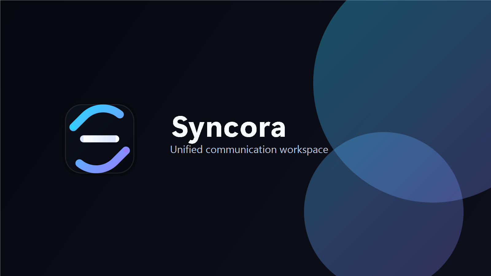

# Syncora

[](LICENSE)



> Screenshot placeholder: add a current desktop screenshot here before the first tagged release.

Syncora is a local-first, privacy-focused desktop Gmail workspace built with Tauri 2. It brings Gmail accounts into a fast native shell with SQLite caching, keyboard-driven navigation, a focused reader, local folder actions, and optional Claude-powered email assistance while keeping OAuth tokens outside the frontend.

## Features

- Tauri 2 desktop app with a React, TypeScript, and Vite frontend
- Gmail OAuth desktop flow with PKCE and loopback callback handling
- OS keyring token storage and Rust-side Gmail API proxying
- Local SQLite cache for accounts, threads, messages, labels, settings, and FTS5 search
- Three-pane workspace with sidebar, virtualized inbox, and sandboxed message reader
- Unified, Inbox, Starred, Sent, Trash, and Archive folder views
- Per-account filtering, quick filters, debounced search, and load-more pagination
- Local message actions for star, archive, move to inbox, move to trash, mark read/unread, empty trash, and permanent delete
- Settings page for accounts, appearance toggles, notification status, and sync controls
- Optional Anthropic/Claude email assistant for summaries, action items, draft replies, and custom prompts
- Professional Syncora brand assets and generated app icons

## Tech Stack

| Layer | Tools |
| --- | --- |
| Desktop | Tauri 2, Rust |
| Frontend | React 18, TypeScript, Vite |
| Styling | Tailwind CSS, lucide-react, framer-motion |
| State | Zustand, TanStack Query |
| Data | SQLite through `@tauri-apps/plugin-sql` |
| Native services | Google OAuth, Gmail API proxy, OS keyring, optional Anthropic API |

## Prerequisites

- Node.js 20+
- npm
- Rust stable
- Tauri desktop prerequisites for your operating system
- Google Cloud project with Gmail API enabled
- Google OAuth desktop client id and client secret
- Optional Anthropic API key for the reader AI prompt bar

## Google Cloud Setup

1. Create or open a Google Cloud project.
2. Enable the Gmail API.
3. Configure the OAuth consent screen.
4. Create an OAuth Client ID with application type `Desktop app`.
5. Copy the generated client id and client secret into the environment files below.

## Install And Run

```bash
npm install
cp .env.example .env
cp src-tauri/.env.example src-tauri/.env
```

On Windows PowerShell:

```powershell
Copy-Item .env.example .env
Copy-Item src-tauri/.env.example src-tauri/.env
```

Configure `.env`:

```env
VITE_GOOGLE_CLIENT_ID=your-desktop-client-id.apps.googleusercontent.com
```

Configure `src-tauri/.env`:

```env
GOOGLE_CLIENT_SECRET=your-google-oauth-client-secret
ANTHROPIC_API_KEY=your-anthropic-api-key
```

`ANTHROPIC_API_KEY` is optional. Gmail works without it, but AI actions in the reader will show a configuration message.

Start the desktop app:

```bash
npm run tauri:dev
```

Useful development commands:

```bash
npm run dev          # Vite frontend only
npm run typecheck    # TypeScript validation
npm run lint         # ESLint
npm run build        # frontend production build
npm run tauri:build  # desktop production bundle
```

## Keyboard Shortcuts

| Shortcut | Action |
| --- | --- |
| `Ctrl+K` / `Cmd+K` | Open command palette |
| `J` | Select next visible thread and mark it read |
| `K` | Select previous visible thread and mark it read |
| `E` | Archive selected thread |
| `S` | Star or unstar selected thread |
| `#` | Move selected thread to trash |
| `U` | Toggle selected thread read/unread |
| `Escape` | Clear thread selection |

## Repository Structure

```text
src/
  app/          App bootstrap, entry point, error boundary
  layouts/      Desktop shell layout
  components/   Brand, navigation, and UI primitives
  features/     Command palette, inbox, reader, settings
  hooks/        Shared React hooks
  services/     AI, auth, Gmail, sync, and Tauri service boundaries
  database/     SQLite client, schema, repositories
  store/        Zustand stores
  types/        Shared TypeScript types
  lib/          Utilities and helpers
  styles/       Global Tailwind CSS
src-tauri/src/  Rust application entry and native command backend
```

Generated folders such as `dist/`, `node_modules/`, and `src-tauri/target/` are intentionally ignored.

## Security Notes

- Do not commit `.env` or `src-tauri/.env`.
- Gmail access and refresh tokens are stored through the native OS keyring.
- The frontend only receives sanitized account and mail data.
- Gmail HTML is sanitized before rendering inside a sandboxed iframe.
- Native-only secrets are read from `src-tauri/.env` and are not placed in Vite environment variables.

## Branding And Icons

The canonical icon source is:

```text
public/brand/syncora-logo.png
```

Regenerate native Tauri icons after changing it:

```bash
npm run brand:icons
```

## Roadmap

- Desktop notifications and notification preferences
- Compose and reply support
- Richer account management and reconnect states
- Mobile packaging exploration
- Tests for normalization, repositories, sync, and native command boundaries
- Packaged preview release notes and screenshots

## Contributing

Contributions are welcome. Please read [CONTRIBUTING.md](CONTRIBUTING.md), keep pull requests focused, include screenshots for UI changes, and run validation before opening a PR.

## License

MIT. See [LICENSE](LICENSE).
